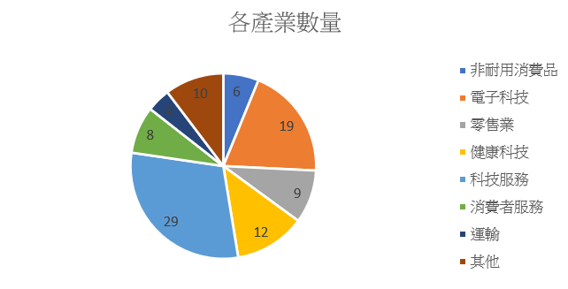

# __Outperformce DJI, Trading with Python__
## 一、	研究簡介

利用並改良Screen法構建長期投資策略，並透過python編寫進出場時機、買賣條件、其他限制條件以及Screen法在程式碼中的實現，以量化分析的方式進行研究，除了能處理大量的數據及計算以外，也能避免人類的非理性所導致的主觀差異。此專案以穩定擊敗市場上的指數並改良screen法為目的。最後會進行歷史資料的回測，並且透過Profit and loss,  Volatility, Sharpe Ratio比較screen及其改良方法以及指數三者的表現。

## 二、	研究方法

此專案中，會以美國市場上交易最活躍的指數之一，NASDAQ 100，為主要研究對象。
引入Screen法，舉體作法如下：
首先，分析指數中各成分股的每月收益率表現，期初等權重的選擇前一個月表現最好的其中幾支成分股；接著，每月期末，賣出持有各股中表現最差的幾支股票(取持股數的一半)，並將其他原本未納入投資組合中的成分股表現最好的納入新的投資組合，每月持續調整我們的投資組合，直到預設投資期限，此專案中，預設投資期限為五年。Screen法跟NASDAQ 100的比較結果如下圖所示。

根據上圖，當持股數超過約15的時候CAGR開始下降，但無論持股數為多少，整體而言，Screen法都能保證擊敗NASDAQ100。(x軸：持股數；y軸：Screen法的CAGR-NASDAQ100的CAGR)

隨著持股數的上升，Screen法的波動度減少，持股超過約20，Screen法的波動度能夠穩定低於NASDAQ100的波動度。(x軸：持股數；y軸：Screen法的CAGR-NASDAQ100的volatility)

持股數過少時，Screen法Sharpe ratio的表現是劣於指數的，當持股數增加時，Sharpe ratio在期初上升快速，中後期逐漸平穩。(x軸：持股數；y軸：Screen法的CAGR-NASDAQ100的Sharpe ratio)

總結來說，Screen法相能在各方面各種持股量都能勝過指數的表現。

根據TradingView(https://tw.tradingview.com/symbols/NASDAQ-NDX/)，我將NASDAQ100的成分股分成8個不同產業類別，具體如下：
1. 非耐用消費品 :  ['PEP', 'MDLZ', 'KDP', 'MNST', 'KHC', 'CCEP']
2. 電子科技 :  ['CSCO', 'TXN', 'AMD', 'NVDA', 'ADI', 'ASML', 'INTC', 'NXPI', 'QCOM', 'MU', 'MCHP', 'GFS', 'ON', 'KLAC', 'HON', 'AAPL', 'AVGO', 'ARM', 'TSLA']
3. 零售業 :  ['ORLY', 'MELI', 'DLTR', 'COST', 'CPRT', 'LULU', 'ROST', 'PDD', 'AMZN']
4. 科技服務 :  ['TMUS', 'SNPS', 'ADSK', 'TTD', 'TTWO', 'PANW', 'META', 'EA', 'ZS', 'NFLX', 'TEAM', 'DDOG', 'ROP', 'ADP', 'INTU', 'MDB', 'PAYX', 'CRWD', 'ADBE', 'GOOGL', 'CDW', 'CTSH', 'FTNT', 'CSGP', 'CDNS', 'VRSK', 'GOOG', 'ANSS', 'MSFT']
5. 健康科技 :  ['REGN', 'GILD', 'MRNA', 'IDXX', 'ILMN', 'BIIB', 'AZN', 'VRTX', 'AMGN', 'GEHC', 'ISRG', 'DXCM']
6. 消費者服務 :  ['MAR', 'BKNG', 'SBUX', 'WBD', 'ABNB', 'CTAS', 'CMCSA', 'CHTR']
7. 運輸 :  ['CSX', 'ODFL', 'DASH', 'FAST']
8. 其他行業 :  ['FANG', 'AMAT', 'LRCX', 'PCAR', 'PYPL', 'LIN', 'XEL', 'AEP', 'CEG', 'EXC']

接著我觀察Screen法每一期的持股狀況，我發現某幾期的持股有過度集中於某些產業或是某些產業占比超過理想持股比例的現象(由於資料量大，詳細資料將存放於此GitHub連結)

NASDAQ100成分股產業比例如下圖所示：

由此可見，最理想的持股比例應該為：
1.	非耐用消費品:  2 (持股數*6/97)
2.	電子科技:  6 (持股數*19/97)
3.	零售業:  3 (持股數*9/97)
4.	科技服務:  9 (持股數*29/97)
5.	健康科技:  4 (持股數*12/97)
6. 消費者服務:  2 (持股數*8/97)
7. 運輸:  1 (持股數*6/97)
8. 其他行業:  3 (持股數*10/97)

接著，我改良了原本的Screen法，後續將其稱為Weighted Screen法，預期改善原本過於集中某些產業的現象以增加策略的表現。
具體做法如下：
首先，分析指數中各產業中各成分股的每月收益率表現，依照上述理想的持股比例，期初在各產業中選擇前一個月表現最好的其中幾支成分股，因此我每期保證會持有30份並且足夠分散化的投資組合，改善了原本可能過於集中於某些產業的問題；接著，每月期末，各產業賣出持有各股中表現最差的股票，數量為一半，並將其他原本未納入投資組合中的成分股表現最好的納入新的投資組合，每月持續調整我們的投資組合，直到預設投資期限(五年)。

## 三、	研究結果

當持股量超過約25時，Weighted Screen法大部分的情況都小幅的勝過Screen法，不過在持股量小於25時，Screen法相較之下在CAGR的表現明顯更好。

波動度的部分，由於有在各產業中充分調配權重，避免了過度投資於某產業的現象，因此，Weighted Screen法從較低的持股量開始就有較低的波動度，隨著持股量的增加，兩方法的波動度逐漸收斂到指數的波動度表現，差異趨近於0。

以Sharpe ratio來看兩方法的差異，關鍵持股數落在約25的地方。當持股數小於25時，Screen法勝過Weighted Screen；當持股數大於25時，Weighted Screen勝過Screen法。

## 四、	結論

Portfolios reblance中的Screen法能很穩定的擊敗指數的表現，不過有時投資組合的調整會過度集中於某些產業。為了避免發生對於某特定產業的重大影響的風險，使用Weighted Screen法將風險公平的分散於指數中成分股的各產業中，能有效的避免此風險，且當此方法的持股數夠大時，也有很大的機會能在Sharpe ratio上勝過Screen法，也就是說能在降低風險的情況下，保留原有的收益率。而對於Screen法來說，少量持有指數成分股才是更好的做法。

## 五、 參考文獻

1.	https://tw.tradingview.com/
2.	https://finance.yahoo.com/
3.	FRM二級中文精讀 金城金融研究院編著

