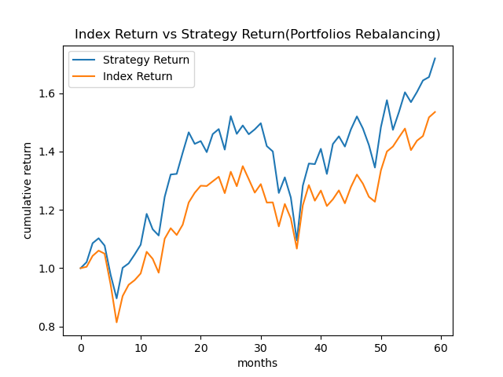

# __Outperformce DJI, Trading with Python__
## 一、	研究簡介
    利用並改良Screen法構建長期投資策略，並透過python編寫進出場時機、買賣條件、其他限制條件以及Screen法在程式碼中的實現，以量化分析的方式進行研究，除了能處理大量的數據及計算以外，也能避免人類的非理性所導致的主觀差異。此專案以穩定擊敗市場上的指數並改良screen法為目的。最後會進行歷史資料的回測，並且透過Profit and loss,  Volatility, Sharpe Ratio比較screen及其改良方法以及指數三者的表現。

## 交易策略說明
### 1. Portfolios rebalancing
#### Target:
    期望長期下能擊敗DJI
#### Tool:
    
1.衡量表現的指標:
       
(1) Compound Annual Growth Rate, CAGR:
        

CAGR = (End Value / Beginning Value)1/N - 1

(2) Sharpe ratio, SR:
        

Sharpe Ratio = (E(Rp) - rf) / σ

(3) Calmar ratio, CR:
        

CR = CAGR / max drawdown

            
#### Data:
        
使用道瓊工業平均指數成分股過去五年(2019/9/1~2024/8/1)每個月的股價資訊
        
#### 策略說明：
    
1. 選取DJI中30支成分股作為主要買賣標的
    
2. 設定投資組合最高持有6張不同DJI的成分股股票
    
3. 每個月計算DJI所有成分股月收益率
    
4. 每個月調整投資組合，將投資組合中表現最差的3檔股票剃除，並加入其餘表現最好的3檔股票

#### 回測：

回測結果如下表：
        
||strategy|DJI|
|:---:|:---:|:---:|
|CAGR|11.45%|8.96%|
|SR|0.3852|0.2858|
|CR|0.4089|0.3861|

CAGR表現比較:

#### 結論
    Monthly portfolios rebalancing的策略在2024/6/30~2024/8/30的整體表現勝過道瓊工業平均指數

### 2. 技術分析
#### Target:
    期望短期下能擊敗DJI
#### Tools
1.技術指標：
    
(1) Renko chart：

    Renko chart, 磚形圖，與平常的K線圖不同的是會以固定大小磚塊替代candles，磚的大小由自己設定，當價格突破了一個磚的大小才會形成新的磚，
    新的磚只會再原磚的45度角處生成；由於需要價格突破了一個磚的大小才會形成磚，而每次價格的突破所需時間皆不同，因此每塊磚之間的時間長度也
    不固定。
        
    磚形圖的優勢在於排除了其他因素，只專注於價格因子。
    我打算利用Renko chart的以上性質建構交易的條件判斷
    
(2) Moving Average Convergence Divergence, MACD :

    在了解MACD之前必須先了解exponential moving average, EMA，EMA為指數加權平均，越靠近當前的數據權重相對高，而越遠離當前的數據權重相
    對低，EMA[t] = a*P[t] + (1-a)EMA[t-1], a=2/(1+N), N為窗口大小。
    MACD = EMA12 - EMA26
    Signal line = EMA9(MACD)，也就是MACD線的EMA, while N=9
        
    買進信號 : 當MACD由下向上穿越Signal line
    賣出信號 : 當MACD由上向下穿越Signal line
    我打算利用MACD的以上性質建構交易的條件判斷

(3) On-Balance Volume, OBV:

    OBV基於每天的交易量變化來計算：
        當日收盤價高於前日收盤價：將當日的交易量加到 OBV 中。
        當日收盤價低於前日收盤價：將當日的交易量從 OBV 中減去。
        當日收盤價等於前日收盤價 : OBV 保持不變。
            
    OBV 線上升時，表明買盤力量強，市場可能處於上升趨勢。
    OBV 線下降時，表明賣盤力量強，市場可能處於下降趨勢。
    我打算利用OBV的以上性質建構交易的條件判斷

(4) Average True Range, ATR:
    
    用於判斷市場的波動性和潛在的價格變動範圍。
        
    TR = max(High-low, |High-pre_close|, |Low-pre_close|)
    ATR = EMA14(TR)
        
2.衡量表現的指標:
       
(1) Compound Annual Growth Rate, CAGR:
        

CAGR = (End Value / Beginning Value)1/N - 1

(2) Volatility, σ:
        

σ = 

(3) Calmar ratio, CR:
        

CR = CAGR / max drawdown

            
#### Data:
    
使用道瓊工業平均指數DJI成分股過去兩個月(2024/6/20~2024/8/20)每五分鐘的股價資訊
    
#### 策略說明：

我將使用不一樣的技術指標，構建出三項交易策略並且比較三者的表現:
1. Renko chart & MACD：

買入信號：連續兩個以上的上升renko bar加上MACD line大於Singnal line，並且MACD line的斜率大於Singnal line斜率
出場時機：MACD line小於Singnal line，並且MACD line的斜率小於Singnal line斜率
    
賣出信號：連續兩個以上的下降renko bar加上MACD line小於Singnal line，並且MACD line的斜率小於Singnal line斜率
出場時機：MACD line大於Singnal line，並且MACD line的斜率大於Singnal line斜率
   
回測：
    
回測結果如下表：
        
||RenkoMACD|DJI|
|:---:|:---:|:---:|
|CAGR|-0.00443%|0.00465%|
|σ|0.0488|0.1294|
|CR|-0.0006|0.0007|

CAGR表現比較:

2. Renko chart & OBV :

買入信號：連續兩個以上的上升renko bar加上OBV斜率 > 30
出場時機：連續兩個下降renko bar
    
賣出信號：連續兩個以上的下降renko bar加上OBV斜率 < -30
出場時機：連續兩個下降renko bar

回測：
    
回測結果如下表：
        
||RenkoOBV|DJI|
|:---:|:---:|:---:|
|CAGR|-0.00112%|0.00465%|
|σ|0.0485|0.1294|
|CR|-0.0003|0.0007|

CAGR表現比較:

3. Resistance Breakout Strategy

構建price resisteance line: 取前20天股價最大值作為當天的上阻力位，取前20天股價最小值作為當天的下阻力位
構建volunm resisteance line: 取前20天交易量最大值並乘上1.5倍作為當天的上阻力位，取前20天交易量最小值並乘上1.5倍作為當天的下阻力位
，volunm resisteance line可以避免假突破的存在

買入信號：價格超過upper price resisteance line且交易量超過volunm resisteance line
出場時機：當天最低價 < (前一天ATR - 前一天最低價)
    
買入信號：價格小於lower price resisteance line且交易量超過volunm resisteance line
出場時機：當天最低價 > (前一天ATR + 前一天最低價)

回測：
    
回測結果如下表：
        
||Break Resistance|DJI|
|:---:|:---:|:---:|
|CAGR|0.00119%|0.00465%|
|σ|0.0249|0.1294|
|CR|0.0014|0.0007|

CAGR表現比較:

#### 結論
||RenkoMACD|RenkoOBV|Break Resistance|DJI|
|:---:|:---:|:---:|:---:|:---:|
|CAGR|-0.00443%|-0.00112%|0.00119%|0.00465%|
|σ|0.0488|0.0485|0.0249|0.1294|
|CR|-0.0006|-0.0003|0.0014|0.0007|

使用單一技術指標的策略表現非常差，DJI的表現皆勝出，MACD以及OBV甚至是負回報，不過，三個策略的波動性都比DJI的波動性要來的小，也就是透過
高一點的風險賺取較多的回報。單個技術指標的分析容易前期表現好，但一段時間後便會開始產生背離。
### 3. 技術分析改良

#### 策略說明：
MACD+OBV+Break Resistance:

構建price resisteance line: 取前20天股價最大值作為當天的上阻力位，取前20天股價最小值作為當天的下阻力位
構建volunm resisteance line: 取前20天交易量最大值並乘上1.5倍作為當天的上阻力位，取前20天交易量最小值並乘上1.5倍作為當天的下阻力位
，volunm resisteance line可以避免假突破的存在

買入信號：價格超過upper price resisteance line且交易量超過volunm resisteance line，除此之外，MACD line大於Singnal line且
         OBV斜率 > 30
出場時機：當天最低價 < (前一天ATR - 前一天最低價) 且 MACD line小於Singnal line
    
買入信號：價格小於lower price resisteance line且交易量超過volunm resisteance line，除此之外，MACD line小於Singnal line且
         OBV斜率 < -30
出場時機：當天最低價 > (前一天ATR + 前一天最低價) 且 MACD line大於Singnal line

回測：
    
回測結果如下表：
        
||MACD+OBV+Break Resistance|DJI|
|:---:|:---:|:---:|
|CAGR|0.00518%|0.00465%|
|σ|0.064|0.1294|
|CR|0.0024|0.0007|

CAGR表現比較:

#### 結論
結合各項指標後的回報穩定上升，能以較低波動度擊敗DJI，成功的在短期下也擊敗了DJI
